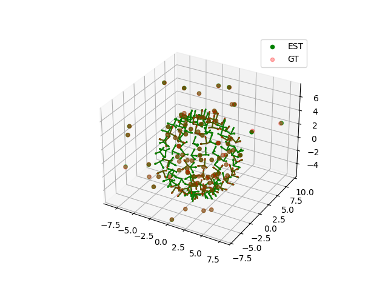

##### Final project for Probabilistic Robotics course 22/23
#### 1b: Camera SFM

1) **Initialize the translations**:
I made use of the estimates provided by step 1a to write the **linear** constraint for each pair: 
$$ e_{ij} = skew(t_{ij})R_i^T(\mathbf{t_i}-\mathbf{t_j}) $$
The solution is up to translation (3) and scale (1). To address this I fixed the first camera position and extracted the **null space of H**, which is then a single vector. This vector represents the relative translation of cameras with respect to the first one up to a scale. The original scale cannot be recovered but it is important to disambiguate the sign ($+t$ or $-t$). To do this I intersected some correspondences and checked that most of those happen at positive values for the ray parameter **s**. If that wasn't the case I flipped the sign of the translation vector.

2) **Triangulate the landmarks**
I chose to formulate a linear LS problem for each landmark. The error function is the distance between the position of the landmark and the rays that come from every camera that measures it (ref: https://silo.tips/download/least-squares-intersection-of-lines). I could do this step and the previous with standard LS because the correspondesces have an inlier ratio of $100$%.

3) **Doing Bundle Adjustment**
To refine the estimate I did some iteration of bundle adjustment, which means adjusting the pose of the cameras and landmarks together. The algorithm is the same as the one published in the course repo. It finds a minima in few iterations (3). 

To generate the output files create a Python virtual environment and run `generate_output.py`. The files will be in the `output` folder. In the `plots` folder there are also some images such as the ground truth and the final estimate overlapped.

